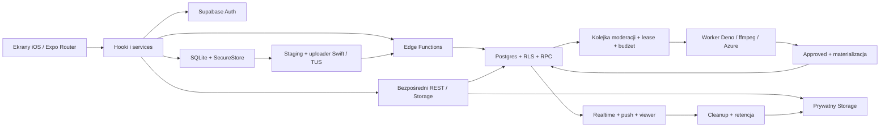

**NiX — szczegółowa analiza projektu, 7 października 2026**

Analizowany commit: `884abe1953e0a20db62a31f2bcfef8365763b404`, gałąź `main`. Drzewo robocze przed audytem było czyste. Analiza obejmuje klienta, migracje i funkcje Supabase, worker moderacji, moduły iOS, konfigurację wydania, testy oraz dokumentację. Nie zmieniono kodu aplikacji ani wdrożenia; dodano ten raport i lokalny materiał reprodukcyjny.

NiX ma rozwiniętą architekturę i dużo wartościowych mechanizmów niezawodności. Największym problemem jest niedomknięta granica zaufania: bezpieczna ścieżka aplikacji współistnieje z mniej restrykcyjnymi zapisami bezpośrednimi do bazy i Storage. Zielone testy jednostkowe nie wykrywają tych obejść. Przed następnym wydaniem publicznym rekomenduję naprawę ustaleń P1 oraz potwierdzenie końcowych polityk na izolowanym Supabase.

P1 oznacza wysoki priorytet: naruszenie autoryzacji, prywatności, retencji lub niedostępność podstawowej funkcji. P2 oznacza błąd niezawodności albo istotną lukę w kontroli jakości. P3 oznacza dług utrzymaniowy. Są to priorytety tego audytu, niezależne od klasyfikacji CVSS w skanerze zależności.

Dowody mają trzy poziomy: **wykonanie** — wynik rzeczywiście uruchomionego polecenia lub deterministycznej reprodukcji; **kod** — prześledzona ścieżka w repozytorium, bez testu na wdrożeniu; **ryzyko** — kwestia wymagająca dodatkowego pomiaru lub oceny osiągalności. Żadne ustalenie dotyczące migracji nie jest potwierdzeniem stanu produkcji.

**Produkt i architektura**

To aplikacja wyłącznie na iPhone/iOS: zdjęcia, wideo i tekst, relacje znajomych, zaproszenia QR, wiadomości efemeryczne i replay, ochrona capture, powiadomienia oraz zgłoszenia i moderacja. Brak Androida jest zgodny z aktualnym zakresem produktu.

| Warstwa | Implementacja | Ocena |
| --- | --- | --- |
| Klient | Expo SDK 57, React 19.2.3, React Native 0.86.3, Expo Router | Jasny wybór jednej platformy; duża zależność od zgodności bibliotek natywnych |
| Dane i stan | TanStack Query, konteksty, hooki ekranów, warstwa services | Rozsądny podział; niektóre hooki i providery przejmują zbyt wiele odpowiedzialności |
| Offline | SQLite, szyfrowane payloady, klucze w SecureStore | Dobry kierunek; problemy współbieżności i anulowania pracy przy zmianie konta |
| Media | staging plików, kompresja, batch/asset/recipient, upload natywny i TUS | Rozwinięty model trwałości; błędy pauzy, retry i cyklu usuwania |
| Backend | Supabase Auth, Postgres/RLS, prywatne buckety, Edge Functions | Dużo zabezpieczeń, ale starsze polityki pozostawiają obejścia nowych kontraktów |
| Moderacja | kolejka SQL, lease, worker Deno/ffmpeg, Azure, budżet w SQL | Mocne mechanizmy kolejki; potrzebne uszczelnienie wszystkich ścieżek dostarczenia |
| iOS | lokalne moduły Swift, SwiftUI, Live Activity, konfiguracja bare | Spójna konfiguracja; podstawowa kamera wymaga poprawy dostępności |



Bezpośredni REST/Storage jest częścią modelu Supabase, dlatego jego polityki muszą zapewniać te same warunki autoryzacji i moderacji co Edge Functions. Kontrole w samym kliencie tego nie zastępują.

Repozytorium zawiera 733 śledzone pliki, w tym 338 w `src`, 129 w `supabase`, 25 w `workers` i 27 w `modules`. Zliczono około 39,6 tys. fizycznych linii w 260 produkcyjnych plikach TS/TSX klienta oraz 7,6 tys. linii testów klienta. Całość plików TS/TSX/Swift/SQL/MJS/CJS to około 80,9 tys. fizycznych linii, łącznie z testami, migracjami i skryptami. Te liczby opisują rozmiar, a nie pokrycie testami czy złożoność cyklomatyczną. Aktywna historia bazy ma 46 migracji.

**Wyniki wykonanych kontroli**

| Kontrola | Wynik | Znaczenie |
| --- | --- | --- |
| `npm test` | PASS: 79 plików, 445 testów | Logika objęta Vitest działa w środowisku Node z mockami modułów natywnych |
| `npm run lint` | PASS | Expo lint obejmuje klienta `src`; nie stanowi pełnego lintu backendu i Swift |
| `npm run typecheck` | FAIL: 5 błędów | Cztery błędy typów tras auth i jeden błąd testu analityki |
| `npm run check-knip` | PASS | W zakresie obecnej konfiguracji i jej wyłączeń |
| Deno check zgodny z listą `deno:check` | PASS | Typy wymienionych funkcji Edge i skryptu spike |
| Deno test zgodny z listą `deno:test` | PASS: 84 testy | Kontrakty Edge, helpers i logika spike |
| Deno test workera, fake provider | PASS: 54 testy | Testy ffmpeg i workera bez wywołań Azure |
| `test:release-env` | PASS: 9 testów | Walidacja wartości i wstawienia preflightu; nie obejmuje poprawnego katalogu dotenv w Xcode |
| Zestaw pięciu testów Node dla guardów C3B | FAIL: 56 PASS / 3 FAIL z 59 | Mocki i dependency injection nie izolują wszystkich wywołań Dockera |
| `check:ios-config` | PASS | Synchronizacja app.json, native config i lokalizacji purpose strings |
| `check:internal-testflight-config` | PASS | Konfiguracja spełnia obecny checker |
| `check:release-env` | PASS z katalogu repo | Wymagane publiczne zmienne są obecne i poprawne składniowo |
| `check:sentry-disabled` | PASS | Domyślna konfiguracja twardo wyłącza Sentry |
| `check:text-outbox-security` | PASS | Checker nie wykrywa opisanej niżej zmiany właściciela podczas flush |
| `check:cleanup-nix-contract` | PASS | Checker nie wykrywa zaufania do klientowskiego `media_path` |
| `check:report-content-contract` | PASS | Obecne asercje statycznego kontraktu przechodzą |
| `check:supabase-migrations` | FAIL | Zamknięty manifest kończy się przed dziesięcioma nowszymi migracjami |
| `doctor:react:ci` | FAIL: 1 warning, wynik 91/100 | Warning o sekwencyjnych await w `workers/moderation/main.ts:99`; sam warning nie dowodzi błędu |
| `expo-install-check` | FAIL: 15 niezgodności wersji | Wynik dla lokalnie zainstalowanego grafu, z wieloma zależnościami wyłączonymi z kontroli |
| `npm ls --depth=0` | FAIL | Zainstalowane `expo-font` i `expo-image` nie spełniają deklarowanych zakresów |
| `npm audit --json` | FAIL: 40 wpisów | 2 critical, 32 high, 6 moderate; wymagają oceny osiągalności |
| Harness klienta | PASS: 3 scenariusze | Odtwarza utratę cache i wysyłkę między kontami przy moderacji ON oraz OFF |
| Integralność produkcyjnych mediów i dowodów moderacji | NIEZWERYFIKOWANE | Checkery wymagają `SUPABASE_DB_URL`, którego nie udostępniono |
| pgTAP / DB lint / pełny flow Storage | NIEZWERYFIKOWANE | Nie udało się odczytać lokalnego kontenera DB; nie resetowano bazy ani nie użyto linked production |
| Xcode Archive, VoiceOver, FPS/RAM, test urządzenia | NIEWYKONANE | Wymagają osobnego uruchomienia na iPhonie i/lub środowiska Xcode |

Pierwszy przebieg klientowych testów i lintu używał domyślnego Node 22.22.3. Powtórzono je na wymaganym Node 24.18.0: nadal 445 testów PASS i lint PASS; typecheck również daje te same pięć błędów. Pozostałe późniejsze kontrole npm/Node używały Node 24.18.0. Deno 2.9.6 i ffmpeg 8.1.2 odpowiadają wymaganiom repo. Nie instalowano ani nie aktualizowano zależności aplikacji. Deno pobrał brakujące elementy własnego cache przy frozen lockfile.

**Ustalenia o wysokim priorytecie**

**F01 · P1 · Media mogą ominąć moderację przez bezpośredni INSERT. Dowód: kod.**

[Polityka nixes_insert](/Volumes/External-drive-lexar/Dev/Projects/NIX/supabase/migrations/20260714104841_remote_baseline.sql:844) wymaga wyłącznie zgodności nadawcy z JWT i `can_send_nix`. [Aktualne can_send_nix](/Volumes/External-drive-lexar/Dev/Projects/NIX/supabase/migrations/20260715095155_add_safety_moderation_and_age_gate.sql:518) sprawdza znajomość, blokady, ograniczenia kont i limit; nie sprawdza approved job ani flagi moderacji. Po przejrzeniu wszystkich 46 migracji nie znaleziono późniejszego zamknięcia tej polityki ani triggera BEFORE INSERT wymuszającego moderację mediów. Kontrakt moderacji dla tekstu nie domyka tej ścieżki mediów.

Scenariusz: zalogowany nadawca mający zaakceptowaną relację uploaduje plik do własnego dozwolonego prefiksu, a następnie tworzy `nixes` przez REST. Dostarczenie nie wymaga worker approve. Dodatkowo polityka INSERT nie wiąże `media_path` z własnością nadawcy: przy znajomości cudzego klucza można utworzyć referencję, której później ufa polityka odczytu Storage.

Naprawa: gdy moderacja jest wymagana, zablokować klientowski INSERT mediów i materializować wyłącznie przez autoryzowany backend. Powiązać asset/path z nadawcą oraz sprawdzić je serwerowo. Test odbiorczy: flaga ON, próba bezpośredniego INSERT jako authenticated musi zostać odrzucona; approved materializacja działa, a cudzy path pozostaje niedostępny.

**F02 · P1 · Zatwierdzony plik pozostaje modyfikowalny przez nadawcę. Dowód: kod.**

[storage_update](/Volumes/External-drive-lexar/Dev/Projects/NIX/supabase/migrations/20260714104841_remote_baseline.sql:1149) dopuszcza UPDATE obiektów pod `nixes/{auth.uid()}/`. Nie uwzględnia statusu assetu, etapu uploadu ani decyzji moderacji; nowsze migracje jej nie zastępują. Jest to również format klucza aktualnego batch uploadu.

Scenariusz: nadawca przesyła bezpieczny plik, czeka na approve, a następnie nadpisuje bajty pod tym samym kluczem. Referencja wiadomości i poprzednia decyzja moderacji pozostają. Naprawa F01 nie wystarczy, jeżeli ta możliwość zostanie zachowana.

Naprawa: zapewnić niezmienność obiektu po finalizacji, np. zamknąć klientowski UPDATE zatwierdzonych assetów i używać nowego klucza dla każdej wersji. Test powinien wykonać rzeczywiste żądanie Storage API i porównać bajty przed i po odrzuconej próbie podmiany.

**F03 · P1 · Nadawca może sam ustanowić zaakceptowaną znajomość. Dowód: kod.**

[friendships_insert](/Volumes/External-drive-lexar/Dev/Projects/NIX/supabase/migrations/20260715095155_add_safety_moderation_and_age_gate.sql:826) nie wymaga `status='pending'`. Tabela akceptuje `accepted`, authenticated zachowuje prawo INSERT, a żaden późniejszy trigger nie narzuca poprawnego przejścia stanów.

Scenariusz: A zapisuje `user_id=A, friend_id=B, status=accepted`, choć B nie zaakceptował zaproszenia. Dla nieblokowanej i nieograniczonej pary taka relacja spełnia warunek wysyłania wiadomości.

Naprawa: klientowski INSERT wyłącznie pending; akceptacja przez adresata z ochroną niezmienności obu końców relacji. Testy muszą obejmować INSERT accepted, prawidłowe pending → accepted i próbę zmiany uczestników relacji.

**F04 · P1 · Cleanup może usunąć plik wskazany przez klienta z uprawnieniami service_role. Dowód: kod.**

[Legacy cleanup](/Volumes/External-drive-lexar/Dev/Projects/NIX/supabase/functions/cleanup-nix-due/index.ts:89) usuwa `item.media_path` pobrany z kolejki. Worker odczytuje kanoniczny nix, ale w tej gałęzi nie porównuje jego path i odbiorcy z pozycją kolejki. [RLS kolejki](/Volumes/External-drive-lexar/Dev/Projects/NIX/supabase/migrations/20260714104841_remote_baseline.sql:829) pozwala klientowi INSERT/UPDATE ze swoim `receiver_id`; FK potwierdza istnienie nixa, a nie zgodność jego odbiorcy.

Scenariusz: wpis dla istniejącego legacy nixa (`asset_id` null) z własnym receiver_id i znanym kluczem innego pliku. Cron wykonuje fizyczne usunięcie tego klucza jako service_role. Scenariusz nie wymaga zgadywania nieznanego klucza, ale wymaga znajomości klucza celu.

Naprawa: wyprowadzać cel usuwania wyłącznie z kanonicznego rekordu, sprawdzać właściciela, stan i czas kwalifikujący do cleanupu; ograniczyć zapis kolejki do bezpiecznego RPC. Test: podrobiony path/receiver nie może spowodować usunięcia kontrolnego obcego obiektu ani aktywnych referencji współodbiorców. PASS obecnego checkera nie stanowi takiego dowodu.

**F05 · P1 · Trwający text outbox może wysłać wiadomość poprzedniego konta jako nowe konto. Dowód: wykonanie z kontrolowanym I/O.**

[flushTextOutbox](/Volumes/External-drive-lexar/Dev/Projects/NIX/src/services/textOutboxService.ts:200) wczytuje listę zadań do pamięci i nie weryfikuje właściciela przed każdą wysyłką. [sendTextMessage](/Volumes/External-drive-lexar/Dev/Projects/NIX/src/services/textMessageService.ts:100) korzysta z aktualnej sesji; RPC `enqueue_own_text_moderation_job` przypisuje nadawcę z aktualnego JWT. [Unmount synchronizacji](/Volumes/External-drive-lexar/Dev/Projects/NIX/src/components/sync/TextOutboxSync.tsx:36) usuwa timery/listenery, ale nie zatrzymuje trwającego flush. Usunięcie rekordów SQLite przy logout nie usuwa kopii z pamięci pętli.

Reprodukcja: dwa zadania A; pierwszy transport zatrzymany; `clearTextOutbox(A)`; zmiana sesji na B; zwolnienie pierwszego żądania błędem UNAUTHORIZED. Drugie rzeczywiste wywołanie serwisu przesyła tekst A jako B. Potwierdzono zarówno enqueue moderacji ON, jak i INSERT fallback przy moderacji OFF. Do zaakceptowania przez backend B musi mieć prawo wysyłania do tego odbiorcy, np. wspólnego znajomego.

Naprawa: pojedynczy flush per owner, anulowanie/inwalidacja generacji przy zmianie konta oraz kontrola owner po każdym await i przed transportem. Żądanie powinno być związane z oczekiwanym właścicielem i odrzucone przy niezgodności. Osobno zatrzymać polling moderacji po zmianie sesji.

**F06 · P1 · Retencja kwarantanny moderacji ma błędną kolejność i brak pełnej ścieżki usuwania. Dowód: kod.**

[cleanup_expired_moderation_quarantine](/Volumes/External-drive-lexar/Dev/Projects/NIX/supabase/migrations/20260831130000_pre_delivery_moderation_expand.sql:528) najpierw usuwa payloady, a dopiero potem zmienia wygasłe zadania pending/processing na error. FK wykonuje SET NULL; [aktualny CHECK](/Volumes/External-drive-lexar/Dev/Projects/NIX/supabase/migrations/20260912150000_fix_moderation_materialize_and_media_finalize.sql:16) nie dopuszcza null payloadu dla pending/processing. Usunięcie payloadu powiązanego z takim zadaniem wycofa transakcję przed zmianą statusu.

W repo nie znaleziono harmonogramu ani wywołania tej funkcji poza definicją i grantami. Odrzucone/błędne media pozostają w `moderation_pending`, podczas gdy istniejący sweeper obsługuje inne stany. Zewnętrzny harmonogram nie został sprawdzony.

Naprawa: najpierw bezpiecznie zakończyć wygasłe zadania, potem usunąć payloady; dodać idempotentny cleanup rejected/error mediów i jawny harmonogram. Test: wygasły pending tekst przechodzi na error, payload znika bez błędu CHECK/FK, a ponowny cleanup pozostaje bezpieczny.

**F07 · P1 · Migawka kamery nie ma standardowej akcji dostępności. Dowód: kod klienta i implementacja RN; brak testu urządzenia.**

[Migawka](/Volumes/External-drive-lexar/Dev/Projects/NIX/src/components/camera/CameraCaptureSurface.tsx:259) to accessible `Animated.View` z rolą button, bez `onAccessibilityTap` i accessibility actions. [Obsługa zdjęcia/wideo](/Volumes/External-drive-lexar/Dev/Projects/NIX/src/hooks/useCameraScreen.ts:1064) opiera się na zdarzeniach dotykowych `Gesture.Pan`. W lokalnej implementacji RN Fabric standardowa aktywacja dostępności widoku bez callbacku nie wywołuje akcji.

Skutek: podstawowa funkcja produktu nie ma poprawnego odpowiednika standardowej aktywacji VoiceOver/Switch Control. Naprawa: semantyczna akcja zrobienia zdjęcia oraz dostępne start/stop nagrania. Kryterium odbioru wymaga fizycznego iPhone’a z VoiceOver i Switch Control.

**Pozostałe błędy i luki utrzymaniowe**

**F08 · P2 · Efemeryczne zdjęcia pozostają w cache dyskowym. Dowód: kod.**

[Viewer](/Volumes/External-drive-lexar/Dev/Projects/NIX/src/components/viewer/ViewerScreenSurface.tsx:91) używa `memory-disk`; [prefetch bieżącej i następnej wiadomości](/Volumes/External-drive-lexar/Dev/Projects/NIX/src/hooks/useViewerScreen.ts:502) również zapisuje na dysku. [Limit cache](/Volumes/External-drive-lexar/Dev/Projects/NIX/src/lib/mediaCache.ts:5) to 500 MiB. Nie ma wywołania clearDiskCache w `src`, również przy cleanupie i wylogowaniu.

Usunięcie obiektu na serwerze lub wygaśnięcie signed URL nie usuwa pobranych wcześniej bajtów lokalnych. Nie stwierdzono, że inne konto może zobaczyć je w UI; ustalenie dotyczy trwałości lokalnej kopii. Dla prywatnych wiadomości efemerycznych należy oddzielić cache avatarów od cache mediów i użyć pamięci albo zarządzanego szyfrowanego cache z retencją i usuwaniem po zakończeniu dozwolonego replay.

**F09 · P2 · Równoległe tworzenie klucza szyfrującego może utracić cały cache. Dowód: wykonanie z kontrolowanym I/O.**

[encryptionKey](/Volumes/External-drive-lexar/Dev/Projects/NIX/src/lib/offlineCacheStore.ts:226) wykonuje get/generate/set bez blokady. Dwa równoległe zapisy pierwszego cache mogą oba zobaczyć brak klucza, wygenerować różne klucze i zaszyfrować różne wiersze. Ostatecznie SecureStore zachowuje jeden z kluczy. [read](/Volumes/External-drive-lexar/Dev/Projects/NIX/src/lib/offlineCacheStore.ts:114) po jednej porażce deszyfrowania czyści wszystkie wiersze i klucz.

Harness uzyskał dwa klucze i dwa wiersze, a przy odczycie błąd dopasowania klucza oraz zero pozostałych wierszy. To test kolejności z mockiem kryptografii, a nie test native AES. Naprawa: wspólna obietnica/lock tworzenia klucza per owner, skoordynowana z clear i generacją sesji. Analogiczny wzorzec istnieje w [kluczu outbox](/Volumes/External-drive-lexar/Dev/Projects/NIX/src/services/textOutboxService.ts:86) i również wymaga ochrony.

**F10 · P2 · Pauza uploadu może zostać cofnięta przez JS lub Swift. Dowód: kod.**

[Progress przygotowania](/Volumes/External-drive-lexar/Dev/Projects/NIX/src/context/UploadQueueProvider.tsx:398) bezwarunkowo zapisuje `state='preparing'`. Po [pauseUpload](/Volumes/External-drive-lexar/Dev/Projects/NIX/src/context/UploadQueueProvider.tsx:713) kolejny callback kompresji może nadpisać paused, a późniejszy guard nie rozpozna zatrzymania. [Watchdog Swift](/Volumes/External-drive-lexar/Dev/Projects/NIX/modules/nix-background-uploader/ios/BackgroundUploadCoordinator.swift:533) po trzech sekundach wznawia suspended task bez sprawdzenia paused; timer retry również wznawia bez tej kontroli.

Naprawa: progress nie może zmieniać stanu sterującego, a wszystkie automatyczne wznowienia muszą respektować bieżący paused/cancelled, właściwą sesję i próbę. Testować pauzę podczas kompresji, tuż po starcie uploadu i podczas oczekiwania na retry.

**F11 · P2 · Natywny foreground upload omija backoff. Dowód: kod.**

[scheduleRetry](/Volumes/External-drive-lexar/Dev/Projects/NIX/modules/nix-background-uploader/ios/BackgroundUploadCoordinator.swift:618) planuje opóźnione resume bez trwałego terminu retry. Completion uruchamia `pumpTasks`, który uznaje suspended retry za kandydata i wznawia go od razu. Skutek: 429/5xx mogą wywoływać szybkie ponowienia zamiast deklarowanej przerwy. Naprawa: termin nextRetryAt respektowany przez wszystkie miejsca wznowienia; test czasu między żądaniami oraz zmiany sieci podczas oczekiwania.

**F12 · P2 · Dwie URLSession współdzielą klucze taskIdentifier. Dowód: kod i kontrakt Apple.**

[responseBodies](/Volumes/External-drive-lexar/Dev/Projects/NIX/modules/nix-background-uploader/ios/BackgroundUploadCoordinator.swift:150) jest mapą `[Int: Data]`, choć koordynator używa sesji background i foreground. [Delegate](/Volumes/External-drive-lexar/Dev/Projects/NIX/modules/nix-background-uploader/ios/BackgroundUploadCoordinator.swift:762) i watchdog identyfikują zadania samym numerem. Apple określa unikalność numeru tylko w obrębie jednej sesji. Kolizja może pomieszać body odpowiedzi lub wznowić inne zadanie. [Dokumentacja taskIdentifier](https://developer.apple.com/documentation/foundation/urlsessiontask/taskidentifier).

Naprawa: klucz zawierający tożsamość sesji i task ID albo niezależny identyfikator próby. Wymagany test jednoczesnego zdjęcia i wideo z tymi samymi numerami zadań. Nie odtworzono tego na urządzeniu.

**F13 · P2 · Backend przyjmuje obrazy większe niż worker potrafi przetworzyć. Dowód: kod.**

[Begin upload](/Volumes/External-drive-lexar/Dev/Projects/NIX/supabase/functions/begin-media-upload/index.ts:38) dopuszcza 10 MiB obrazu, a [loadMediaAsset](/Volumes/External-drive-lexar/Dev/Projects/NIX/workers/moderation/download.ts:214) odrzuca ponad 4 MiB. Rozwiązanie zadania następuje podczas claim, przed kodem complete; wyjątek pozostawia processing do wygaśnięcia lease, po czym ten sam błąd może się powtarzać.

Naprawa: wspólne limity/transformacja, terminalne zakończenie niedopuszczalnych wejść i ochrona etapu stagingu. Zwykła kompresja klienta może zmniejszać częstość, ale API nadal przyjmuje wadliwy zakres. Testować 4 MiB, nieco ponad 4 MiB, 10 MiB oraz uszkodzony plik przy użyciu rzeczywistej kolejki SQL.

**F14 · P2 · Dwa cleanupy eksportu mogą osierocić archiwum. Dowód: kod.**

[SQL cleanup](/Volumes/External-drive-lexar/Dev/Projects/NIX/supabase/migrations/20260729120000_ios_product_roadmap.sql:671) zmienia ready na expired i później usuwa job. [Edge cleanup](/Volumes/External-drive-lexar/Dev/Projects/NIX/supabase/functions/process-data-exports/index.ts:210) pobiera tylko expired czasowo ze statusem ready. Jeśli SQL zmieni status wcześniej, Edge nie usunie obiektu. Edge także nie sprawdza wyniku remove przed wyzerowaniem storage_path.

Naprawa: jedna ścieżka fizycznego usuwania, obejmująca expired z zachowanym path; dopiero sukces usuwa referencję. Test: SQL expiry przed Edge oraz błąd Storage remove, po którym kolejny przebieg skutecznie ponawia usuwanie.

**F15 · P2 · Zadeklarowane bramki jakości nie przechodzą i nie weryfikują wszystkich istotnych zachowań. Dowód: wykonanie i kod.**

Typecheck: [register](/Volumes/External-drive-lexar/Dev/Projects/NIX/src/app/(auth)/register.tsx:192), [login actions](/Volumes/External-drive-lexar/Dev/Projects/NIX/src/components/auth/login/login-actions-section.tsx:42) i [test analityki](/Volumes/External-drive-lexar/Dev/Projects/NIX/src/services/productAnalyticsService.test.ts:10). Cztery błędy dotyczą wygenerowanych typów Expo Router, a piąty spread argumentu. Trasy auth istnieją, dlatego błędy typów nie są dowodem, że nawigacja jest zepsuta w runtime; należy sprawdzić regenerację typów na czystym checkout i rzeczywiste otwarcie dokumentów.

[Manifest migracji](/Volumes/External-drive-lexar/Dev/Projects/NIX/scripts/check-supabase-migrations.mjs:42) jest nieaktualny. Nie wynika z tego uszkodzenie migracji; wynika realne FAIL gate. React Doctor blokuje jeden warning o await. W tym miejscu pobranie assetu, wybór pliku i download tworzą logiczną sekwencję; diagnostykę trzeba ocenić w kontekście, zanim kod zostanie zmieniony.

[Checker cleanupu](/Volumes/External-drive-lexar/Dev/Projects/NIX/scripts/check-cleanup-nix-contract.mjs:4) sprawdza markery tekstowe. [Test poprawki materializacji](/Volumes/External-drive-lexar/Dev/Projects/NIX/supabase/tests/fix_moderation_materialize_and_media_finalize_test.sql:5) bada definicje funkcji i constraintu, zamiast wykonywać pełny przepływ. Część testów moderacji sprawdza flagę OFF lub istnienie triggera; nie wykonuje prób obejścia ON. Testy budżetu i lease mają bardziej wartościowe przypadki behawioralne.

Workflow PR w [EAS](/Volumes/External-drive-lexar/Dev/Projects/NIX/.eas/workflows/lint-test.yml:1) ma wiele kontroli klienta, ale nie uruchamia pgTAP, suite workera ani pełnej weryfikacji kontraktów Storage. Osobny workflow internal TestFlight zawiera Deno, lecz również nie zastępuje testu końcowych polityk DB.

Naprawa: przywrócić działające gates na czystym środowisku i dodać testy zachowania dla F01–F06. Wynik skanera lub obecność słowa w SQL nie powinny być jedyną przesłanką bezpieczeństwa.

**F16 · P2 · Graf zależności i lokalne środowisko wymagają uporządkowania. Dowód: wykonanie; osiągalność podatności nie została potwierdzona.**

Lokalny `node_modules` różni się od lockfile, m.in. Expo: zainstalowane 57.0.16, lockfile 57.0.19; expo-font: 57.0.2 versus 57.0.3; expo-image: 57.0.3 versus 57.0.4. Dwa ostatnie pakiety są oznaczone invalid przez npm względem package.json. `expo install --check` wskazuje 15 niezgodności wersji; wiele innych pakietów wyłączono przez [expo.install.exclude](/Volumes/External-drive-lexar/Dev/Projects/NIX/package.json:166). Wyniki audytu runtime dotyczą więc tego konkretnego lokalnego grafu, a nie gwarantowanego rezultatu `npm ci`.

Audit lockfile zwrócił 40 wpisów, ale są wśród nich efekty przechodnie; nie oznacza to 40 niezależnych podatności aplikacji. Krytyczne wpisy npm to proxy-addr 2.0.7 i shell-quote 1.10.0, osiągalne w narzędziach Metro/RN/CLI. Advisory proxy-addr wymaga określonej konfiguracji trusted proxy; shell-quote wymaga odpowiedniego połączenia tokenu komentarza i niezaufanego tekstu. Nie wykazano takiej ścieżki ataku w aplikacji iOS. Wersje naprawiające te problemy to odpowiednio 2.0.8 i 1.11.0. [Advisory maintainerów proxy-addr](https://github.com/jshttp/proxy-addr/security/advisories/GHSA-jqcg-44mw-7w3h), [advisory maintainerów shell-quote](https://github.com/ljharb/shell-quote/security/advisories/GHSA-pqg4-j6r4-53mv).

Wymagają przeglądu także MCP SDK w narzędziu deweloperskim oraz pinned overrides `brace-expansion=5.0.9` i `js-yaml=4.3.1`, które nadal są zgłaszane przez npm audit. Naprawę prowadzić na zgodnym zestawie Expo/RN w izolowanym checkout, z zachowaniem patch-package i kontrolą native. Nie stosować automatycznie proponowanych przez npm audit downgrade’ów Expo do bardzo starego SDK.

**F17 · P2 · TypeScript nie zabezpiecza całego kontraktu Supabase. Dowód: kod.**

[createClient](/Volumes/External-drive-lexar/Dev/Projects/NIX/src/lib/supabase.ts:27) nie ma parametru `<Database>`. Ręczne typy zawierają nowe RPC own moderation, ale pomijają część tabel durable/moderation, nixes.asset_id i RPC workerów. W services pozostały `any` i fallbacki do starszych wersji schematu.

Naprawa: generować typy z autorytatywnego końcowego schematu w izolowanym środowisku, użyć typowanego klienta i jawnych adapterów dla obsługiwanej kompatybilności. Dodanie samych deklaracji bez `<Database>` nie daje walidacji nazw i parametrów RPC. Nie usuwać fallbacków przed ustaleniem, które wersje backendu muszą być wspierane.

**F18 · P2 · Preflight lokalnego Archive zależy od bieżącego katalogu. Dowód: reprodukcja uruchomienia validatora i kod.**

[Plugin](/Volumes/External-drive-lexar/Dev/Projects/NIX/plugins/withIosReleaseEnvValidation.js:7) uruchamia validator pod absolutną ścieżką, ale bez przekazania root. [Validator](/Volumes/External-drive-lexar/Dev/Projects/NIX/scripts/validate-release-env.mjs:35) ładuje dotenv z `process.cwd()`. Wywołanie z `ios/`, gdy publiczne zmienne nie są wcześniej wyeksportowane do shell, zgłasza ich brak mimo konfiguracji w katalogu repo. To potencjalna blokada Archive zależna od środowiska, nie dowód, że poprzednie archiwum było błędne.

Naprawa: jawne `--project-root` lub root wyprowadzony z położenia skryptu, oraz test z katalogu `ios/` i prawdziwym ładowaniem dotenv. Obecne dziewięć testów preflightu wyłącza dotenv.

**F19 · P2 · Uprawnienia, lokalizacja i gestowe kontrolki mają luki UX. Dowód: kod; test urządzenia wymagany.**

[Ekran kamery](/Volumes/External-drive-lexar/Dev/Projects/NIX/src/components/camera/CameraScreenRoot.tsx:28) zawsze ponawia requestPermission; hook nie obsługuje `canAskAgain=false` ani przejścia do Settings. Po trwałej odmowie użytkownik zostaje z przyciskiem, który nie może odzyskać dostępu. Należy użyć stanu permission, wejścia do Settings i ponownego odczytu po powrocie.

[Slider tekstu](/Volumes/External-drive-lexar/Dev/Projects/NIX/src/components/preview/PreviewTextSizeSlider.tsx:153) ma wyłącznie tap/pan, bez semantyki adjustable/value i increment/decrement. Kamera, viewer i [Live Activity](/Volumes/External-drive-lexar/Dev/Projects/NIX/src/widgets/UploadStatusActivity.tsx:49) zawierają polskie komunikaty niezależne od i18n. Live Activity nie dostaje locale w props. Test parzystości kluczy nie wykrywa tekstu wpisanego bezpośrednio w JSX. Naprawę zweryfikować w EN/PL, VoiceOver, Dynamic Type i po odmowie uprawnień.

**F20 · P2 · Testy guardów mogą uruchamiać prawdziwy Docker mimo wstrzykniętego mocka. Dowód: wykonanie i kod.**

Trzy FAIL w `c3b-auth-storage-verify.test.mjs` mają wspólną przyczynę: brak mocka `docker image inspect` powoduje przejście do build, który [wywołuje spawn bezpośrednio](/Volumes/External-drive-lexar/Dev/Projects/NIX/scripts/c3b-auth-storage-verify.mjs:413), omijając injected `run`. W audycie podjęto rzeczywistą próbę Docker build; zakończyła się brakiem dostępu do socketu daemona. Testy nie dotarły do oczekiwanych operacji network/teardown.

Naprawa: wszystkie procesy zewnętrzne muszą przechodzić przez wstrzykiwaną abstrakcję, a mocki obejmować nowy preflight. Test jednostkowy powinien być deterministyczny bez daemona i sieci. Wynik 56/59 nie potwierdza działania pełnego integration stack.

**F21 · P3 · Dokumentacja wydania ma sprzeczne informacje. Dowód: kod dokumentacji.**

[Kanon iOS](/Volumes/External-drive-lexar/Dev/Projects/NIX/docs/release/ios-current.md:18) zapisuje Waiting for Review dla 1.0.11 (6), z 12 września 2026. [README](/Volumes/External-drive-lexar/Dev/Projects/NIX/README.md:38) nadal podaje NO-GO. [Runbook OTA](/Volumes/External-drive-lexar/Dev/Projects/NIX/docs/DEPLOY_IOS_TESTFLIGHT.md:73) zawiera runtime 1.0.10, podczas gdy app/native używają 1.0.11; dalsza sekcja podaje Node 20+, choć engine to 24.x. Historyczny performance audit opisuje także Androida, niewchodzącego do aktualnego zakresu.

Naprawa: jeden aktualny kanon, historyczne raporty wyraźnie oznaczone jako snapshot i aktualne przykłady poleceń. Statusu ASC na 7 października nie sprawdzono; wrześniowy zapis nie jest bieżącym potwierdzeniem.

**F22 · P3 · Największe moduły utrudniają niezależne testowanie i kontrolę zmian. Dowód: metryki i kod.**

ChatScreenSurface ma około 1618 linii, useCameraScreen 1285, UploadQueueProvider 1284, preview 1170, natywny coordinator 1109, nixService 930 i mediaService 900. Sama długość nie jest błędem, ale odpowiada tu współistnieniu UI, I/O, stanów, timerów i obsługi retry, co utrudnia wykrywanie wyścigów F05/F10/F11.

Naprawa po uszczelnieniu bezpieczeństwa: oddzielić transport, przejścia maszyny stanów, scheduler, persystencję i prezentację; wyodrębniać według odpowiedzialności, zachowując istniejące kontrakty. Priorytet mają testowalne przejścia stanów i ownership, a nie mechaniczne rozbijanie JSX.

**F23 · P2 · Odrzucona treść jest automatycznie ponawiana przez outbox. Dowód: kod.**

[Polityka błędów końcowych](/Volumes/External-drive-lexar/Dev/Projects/NIX/src/lib/textOutboxPolicy.ts:3) nie zawiera `CONTENT_NOT_ALLOWED`, chociaż serwis wysyłki zwraca ten kod dla odrzucenia moderacji i filtra treści. [Flush](/Volumes/External-drive-lexar/Dev/Projects/NIX/src/services/textOutboxService.ts:224) przywraca wtedy pending i ustawia kolejne próby. Efekt: trwała odmowa pozostaje ponawiana do wygaśnięcia lokalnego zadania, zamiast otrzymać końcowy stan failed. Idempotency może ograniczyć nowe analizy providera, ale nie usuwa zbędnego ruchu i błędnego stanu UI.

Naprawa: klasyfikować odrzucenie treści jako terminalne oraz jawnie oddzielić błędy przejściowe od trwałych odmów. Test odbiorczy: pojedynczy wynik CONTENT_NOT_ALLOWED zapisuje failed, a następny automatyczny flush nie ponawia transportu.

**Co jest dobrze zaprojektowane**

- Auth rozróżnia brak sesji, stan offline i odzyskiwalne błędy, zamiast traktować każdy błąd sieci jako konieczność logout. Query cache jest czyszczony przy zmianie tożsamości; pozostał problem anulowania trwających operacji.
- Supabase Auth używa SecureStore i processLock; Apple Sign In ma nonce. Usunięcie konta Apple sprawdza tożsamość z Auth i podpis/sub tokenu, zamiast ufać polu profilu.
- Upload ma staging, persystencję SQLite, idempotency, batch i jeden wspólny asset dla odbiorców. Cleanup współdzielonych mediów liczy aktywne referencje i ma ochronę transakcyjną.
- Worker ma lease, odzyskiwanie approved bez materializacji, SKIP LOCKED, ochronę budżetu i zamknięcie dostarczania przy błędach providera. Testy fake provider i ffmpeg mają wartość praktyczną.
- Moduły natywne ograniczają backup staged uploads, a konfiguracja iOS ma zgodne purpose strings PL/EN i wyłączone arbitrary ATS loads.
- Centralne tokeny koloru, motion, native chrome i tłumaczone etykiety tabów stanowią solidną bazę UI.
- Istnieją świadome ograniczenia telemetrii i minimalizacja danych; SDK Sentry jest domyślnie wyłączone. Publiczny anon key nie jest sam w sobie sekretem — bezpieczeństwo zależy od końcowych RLS i autoryzacji.

**Wydajność, prywatność i eksploatacja — granice wniosków**

Klient używa FlashList w czacie, kompresji i porcjowania TUS, batchowanych profili i prefetchu. Są to sensowne mechanizmy, ale ten audyt nie zmierzył FPS, p95 czasu gotowości kamery, szczytowego RAM ani zużycia baterii. Nie należy zastępować takich pomiarów oceną skanera 91/100 lub historycznymi szacunkami pamięci.

[Czat](/Volumes/External-drive-lexar/Dev/Projects/NIX/src/hooks/useChatScreen.ts:145) pobiera po 50 tekstów i nixów, bez pełnej paginacji w tym hooku; [inbox tekstowy](/Volumes/External-drive-lexar/Dev/Projects/NIX/src/services/textMessageService.ts:255) pobiera ostatnie 100 tekstów łącznie. Duża aktywność jednego peer może wypierać starsze, nadal niewygasłe rozmowy. To ograniczenie skalowania/produktu do sprawdzenia na reprezentatywnych danych, a nie potwierdzony błąd codziennego użycia.

Szyfrowanie SQLite chroni lokalne payloady. Obecna ścieżka serwerowa przechowuje/analizuje treść wiadomości i mediów; nie jest to end-to-end encryption. Ochrona screenshotów jest mechanizmem UX/platformowym i nie zastępuje autoryzacji danych ani retencji. W tym audycie nie stwierdzono błędu polegającego na pokazaniu mediów przed zakończeniem ustalania polityki capture — viewer ma odpowiedni gate.

[Monitoring](/Volumes/External-drive-lexar/Dev/Projects/NIX/src/lib/monitoring.ts:28) po wyłączeniu Sentry instaluje sink, który w produkcji nie wysyła telemetry events. Ogranicza to diagnozę błędów klienta; nie jest samodzielnym defektem, bo odpowiada świadomemu wyborowi prywatności. Potrzebny jest jednak praktyczny proces zbierania zminimalizowanych dowodów awarii i operacyjne alerty na zalegające kolejki, orphan objects, błędy retencji i wyczerpanie budżetu.

Nie sprawdzono indeksów z EXPLAIN na rzeczywistej skali, produkcyjnych flag, wdrożonych wersji Edge, stanu cron, liczby jobów, SLA moderatorów, aktualnego ASC ani taryfy Azure. Część cron migracji wskazuje konkretny host funkcji, więc testy odtwarzania schematu powinny mieć izolację egress. Brak tych kontroli jest jawnie pozostawioną granicą audytu, a nie dowodem awarii produkcji.

**Proponowana kolejność pracy i kryteria odbioru**

| Etap | Zakres | Warunek zakończenia |
| --- | --- | --- |
| 1. Granica zaufania | F01–F04 | Authenticated nie omija moderacji, nie podmienia approved mediów, nie tworzy accepted relacji i nie usuwa obcych plików |
| 2. Tożsamość i retencja | F05–F06, F08–F09, F14 | Zmiana konta anuluje stare żądania; retencja usuwa payloady, media, archiwa i właściwe lokalne kopie; retry cleanupu działa |
| 3. Dostępność podstawowej funkcji | F07, odpowiednie fragmenty F19 | Zdjęcie i start/stop wideo działają przez VoiceOver/Switch Control; odmowa permission ma drogę do Settings |
| 4. Upload i worker | F10–F13, F23 | Pauza jest trwała; retry respektuje czas; sesje nie kolidują; dopuszczone rozmiary kończą job terminalnie, a odrzucona treść nie jest ponawiana |
| 5. Powtarzalne wydanie | F15–F18, F20–F21 | Czyste środowisko z lockfile przechodzi uzgodnione gates; testy DB/Storage wykonują zachowania, unit testy nie uruchamiają Docker live |
| 6. Utrzymanie i pomiary | F22, paginacja, observability | Wydzielone maszyny stanów i reprezentatywne pomiary p95/RAM; znane limity produktu i operacyjne alerty |

Nie ma potrzeby przepisywania projektu. Największy zwrot da domknięcie autoryzacji po stronie serwera, uporządkowanie ownership i stanów asynchronicznych oraz dodanie kilku testów behawioralnych obejmujących konkretne regresje.

**Materiał reprodukcyjny**

[Harness klienta](/Volumes/External-drive-lexar/Dev/Projects/NIX/docs/audit-evidence/2026-10-07-client-races.cjs) ładuje rzeczywiste serwisy TypeScript i mockuje SQLite, SecureStore, kryptografię oraz transport. Jest lokalny: nie łączy się z Supabase ani Azure. Z katalogu repo można wykonać:

```sh
node docs/audit-evidence/2026-10-07-client-races.cjs
```

Wynik oczekiwany dla analizowanego kodu: `CACHE_KEY_RACE` z dwoma kluczami i utratą dwóch wierszy; `OUTBOX_ACCOUNT_RACE` pokazujący drugi tekst konta A wysłany przez aktora B, osobno dla moderacji true i false. Asercje potwierdzają istnienie błędów; po naprawie powinny zostać zastąpione testami regresji oczekującymi bezpiecznego zachowania.

Logi wykonania tego audytu są lokalnie pod `/tmp/nix-audit-*`; są pomocnicze i mogą zniknąć po czyszczeniu katalogu tymczasowego. Raport i harness są trwałymi materiałami w repozytorium. Audyt nie wykonuje poprawek wymienionych ustaleń ani nie wydaje zapewnienia o bezpieczeństwie wdrożonej produkcji.
